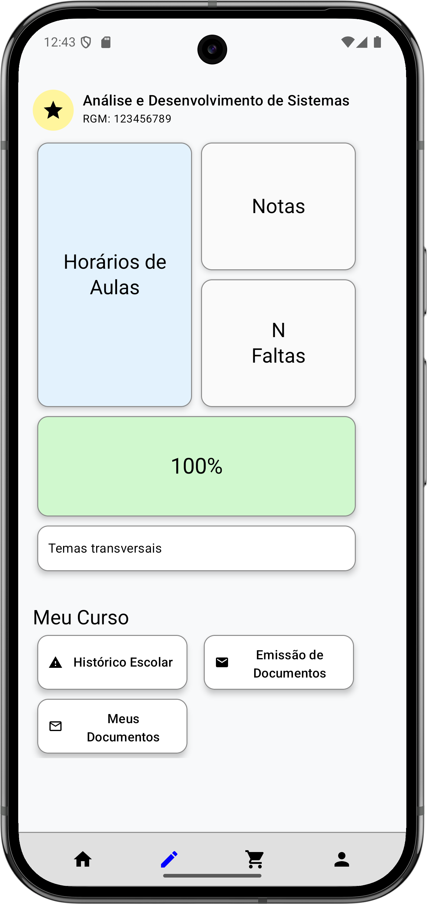
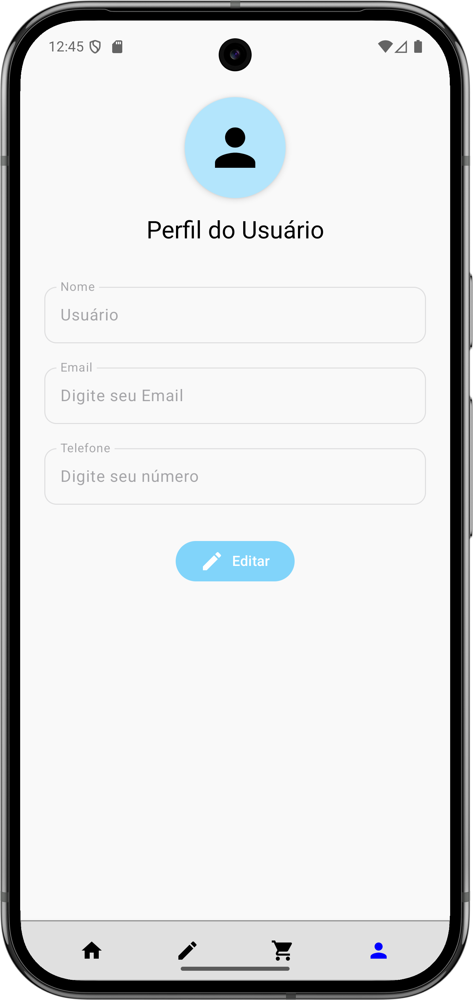
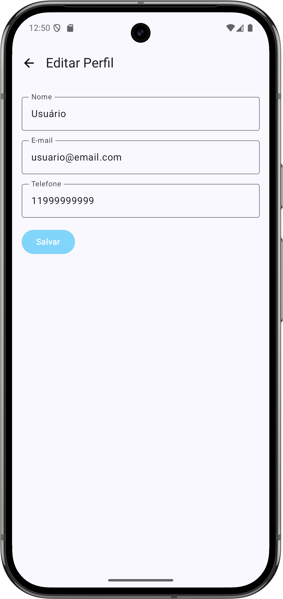
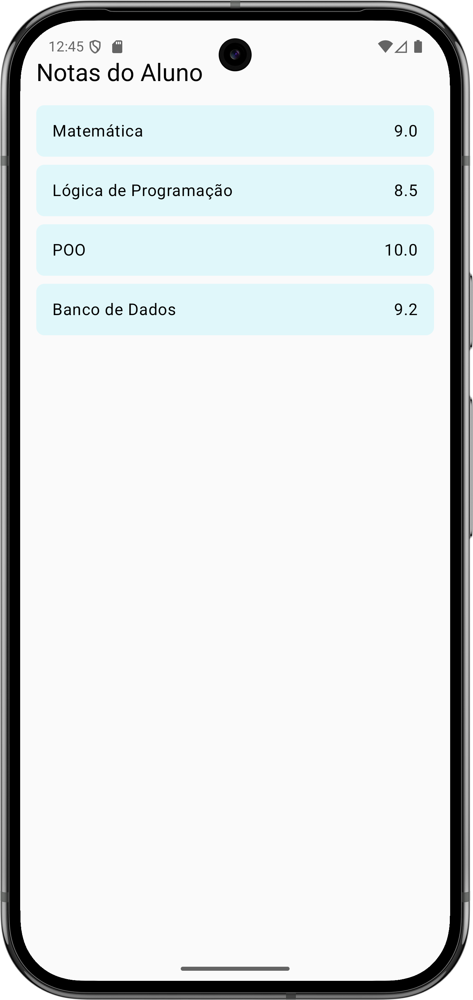

# 🎓 Projeto Duda

Aplicativo Android desenvolvido em **Kotlin + Jetpack Compose**, simulando um **ambiente universitário digital**.  
O app permite acessar cursos, editar perfil, acompanhar o financeiro com opções de pagamento e muito mais.  

---

## 📱 Telas do Aplicativo  

<p align="center">
  
  
  
</p>

<p align="center">
  
  
  
</p>  

---

## 🚀 Tecnologias Utilizadas  

- **Kotlin**  
- **Jetpack Compose**  
- **Material 3**  
- **Navigation Compose**  
- **Android Studio**  

---

## ▶️ Como Rodar  

1. Clone este repositório:  
   ```bash
   git clone https://github.com/JoaoVilaruel/ProjetoDuda.git
   ```  

2. Abra no **Android Studio**.  
3. Sincronize as dependências com o **Gradle**.  
4. Rode em um **emulador** ou **dispositivo físico Android**.  

---

## 📌 Melhorias Futuras  

- 🔗 Integração com API real da universidade.  
- 🔑 Implementar tela de login e autenticação.  
- 📢 Notificações push para alertas de pagamentos e documentos.  
- 🌙 Suporte total a **Dark Mode**.  
- 💳 Integração real com gateways de pagamento (**PIX** e **boleto**).  

---

👨‍💻 Desenvolvido por [João Alexandre Vilaruel dos Santos](https://github.com/JoaoVilaruel) e Caio Voitena  
